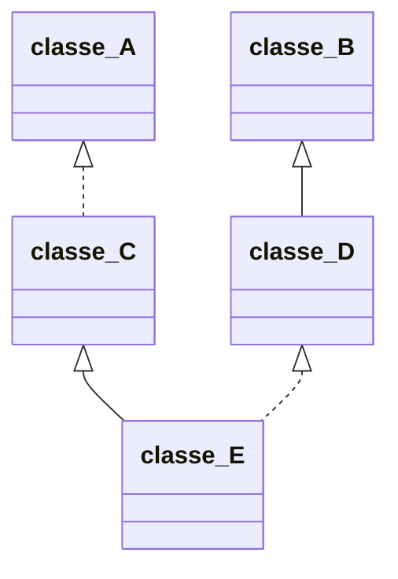
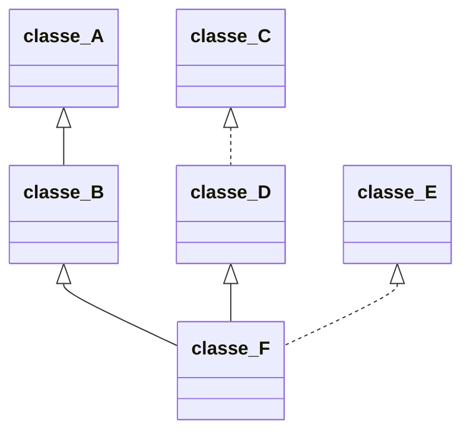
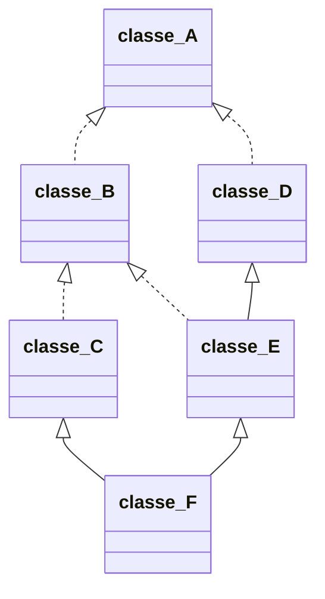
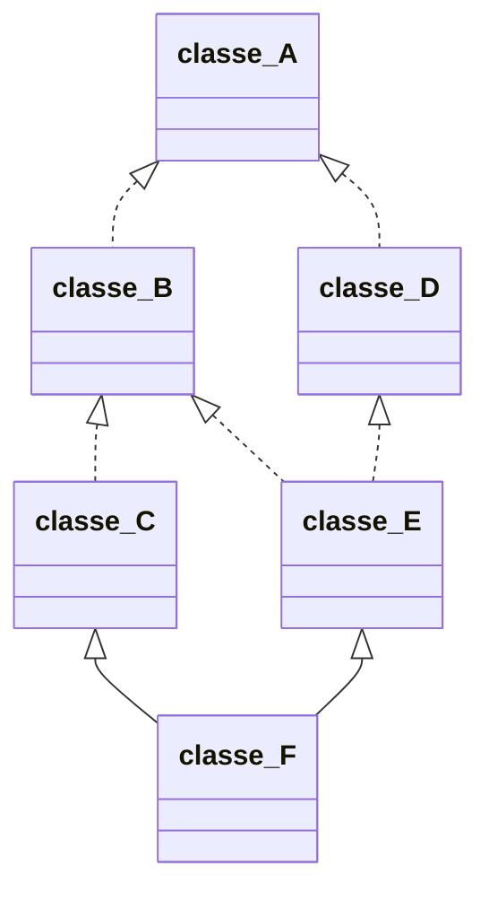

Tag: [[P.A.O]] [[Classi]] [[Ereditarietà]]

# Definizione
>[!def] Ereditarietà Multipla #Definizione 
>Una classe può essere derivata da più di una classe base.
>Si parla di ereditarietà multipla

Con l'ereditarietà multipla ogni oggetto della classe derivata contiene un sottooggetto per ognuna della classi base da cui deriva.
> In generale, la tipologia di derivazione può essere diversa per ogni classe base
> L'ordine in cui vengono eseguiti i costruttori delle classi base è comunque sempre quello in cui compaiono testualmente le classi base nella definizione della classe derivata.

>[!question] Cosa succede invece se due metodi identificati dallo stesso nome sono definiti in due classi base diverse della stessa classe derivata?
>Generano un errore di compilazione: a causa *dell'ambiguità* dell'invocazione il compilatore non è in grado di decidere quale dei due metodi usare.
>>[!info] N.B.
>>La generazione dell'errore avviene soltanto quando si cerca di usare tale metodo su di un oggetto della classe derivata `dataora` e non a causa della definizione della classe derivata `dataora` stessa.
>>

==Se avessimo ridefinito il metodo nella classe `dataora` esso avrebbe nascosto entrambi i metodi delle classi base e non ci sarebbe quindi stata alcuna ambiguità.==

# Derivazione Virtuale
>[!def] Ereditarietà a Diamante #Definizione 
>Può accadere che una classe derivi da due classi base, le quali a loro volta derivano direttamente o indirettamente, da una stessa classe.
>```mermaid
>classDiagram
>
>A <|-- B
>
>A <|-- C
>
>B <|-- D
>
>C <|-- D
>
>class A {
> Abstract
>}
>```

In questo tipo particolare di situazione succede che `D` ha, per [eredità](Eredità) due sottooggetti della classe `A`, uno lo eredita da `B` e l'altro da `C`.
Il che porta a due problemi:
- Produce *ambiguità* che impedisce di accedere a tali sottooggetti ed ai metodi che operano su di essi;
- Produce uno spreco di memoria;

Si consideri il seguente esempio:
```cpp
class A {
public:
	void print() = 0; // virtuale puro
};

class B: public A {
public:
	virtual void print() { cout << "B "; } // implementazione
};

class C: public A {
public:
	virtual void print() { cout << "C "; } // implementazione
};

class D: public B, public C {
virtual void print() override { cout << "D "; } // override
};
```

>[!error] Non compila ancora per ambiguità
>```cpp error:2,3
>D d;
>A* p = &d; // A è una classe base ambigua per d (non sa quale scegliere)
>p->print(); // la chiamata polimorfa non è legale
>```

>[!success] Soluzione
>La soluzione sarebbe quella di avere un sottooggetto unico di classe `A` in ogni oggetto di `D`.
>```mermaid
>classDiagram
>
>A <|.. classeB
>
>A <|.. classeC
>
>classeB <|-- D
>
>classeC <|-- D
>
>class A {
> Abstract
>}
>```
> Questo si può ottenere utilizzando la *derivazione virtuale*, che nelle figure che rappresentano gerarchie di classi indicheremo con frecce tratteggiate.
> Si ottiene con la keyword `virtual`, che quindi è sovraccaricata da un doppio significato.
> >[!example] Es
> >```cpp
> >class A {};
> >
> >class B: virtual public A {};
> >
> >class C: virtual public A {};
> >
> >class D: public B, public C {};
> >```

>[!def] Classe base virtuale #Definizione 
>Si dice che `A` è una *classe base virtuale*. Vi è una classe che deriva virtualmente da `A`.

Per ogni classe `D` derivata da `A` e definita tramite derivazione multipla il fatto che `A` sia una classe base virtuale garantisce che ci sarà un solo sottooggetto di `A` in ogni oggetto della classe `D`.
Nella pratica essa è implementata tramite dei puntatori.
Gli oggetti delle classi `B` e `C` che derivano virtualmente da `A` oltre al sottooggetto "ordinario" della classe `A` contengono un puntatore ad un oggetto della classe `A`.
Dunque gli oggetti della classe `D` conterranno invece un puntatore ad un unico sottoogetto di tipo `A`.

---
Anche per la derivazione virtuale multipla possiamo avere derivazione privata, pubblica o protetta.
Inoltre la derivazione protetta prevale su quella privata e la derivazione pubblica prevale su quella protetta.

>[!info] Comportamento Costruttore classe `D`
>In presenza di classi base virtuali, il costruttore di una classe derivata richiama preliminarmente, o con una invocazione implicita, anche i costruttori della classi virtuali che si trovano nella sua gerarchia di derivazione.
>La motivazione di ciò sta nel fatto che il sottooggetto di una classe base virtuale `A` è condiviso e quindi non avrebbe senso costruirlo più di una volta.
>Il comportamento aggiornato diventa quindi:
>1. Per primi vengono chiamati, per una sola volta, i costruttori delle classi virtuali che si trovano nella gerarchia di derivazione di `D`.
>   ==La ricerca di classi virtuali procede esaminando le superclassi dirette di `D` seguendo l'ordine da sinistra verso destra, dall'alto verso il basso.==
>2. Una volta invocati i costruttori delle classi virtuali nella gerarchia di derivazione di `D`, vengono richiamati i costruttori delle superclassi dirette non virtuali di `D`.
>3. Infine viene eseguito il costruttore virtuale "proprio" di `D`, ovvero vengono costruiti i campi dati propri di `D` e quindi viene eseguito il corpo del costruttore di `D`.

Le chiamate dei costruttori dei punti (1) e (2), se non sono esplicitamente definite, vengono automaticamente inserite dal compilatore nella lista di inizializzazione del costruttore di `D`.

>[!important] Concludendo
>Il compito di costruire il sottooggetto della classe base virtuale `A` viene laciato alla classe dell'oggetto principale che stiamo definendo, nel nostro caso al costruttore della classe `D`. 
>Pertanto una eventuale chiamata esplicita al costruttore della classe virtuale `A` deve essere messa nella lista di inizializzazione della classe `D`.
>Se nelle liste di inizializzazione delle classi `B` e `C` compare una invocazione al costruttore di `A`, nella costruzione di un oggetto di `D`, tale chiamata viene ignorata.
>


# Esempi
###### Es. 1


```cpp
class A { public: A() { cout << "A ";} };
class B { public: B() { cout << "B ";} };
class C: virtual public A { public: C() { cout << "C ";} };
class D: public B  { public: D() { cout << "D ";} };
class E: public c, virtual public D { public: E() { cout << "E ";} };

int main() { E e; } // Stampa: A B D C E
```

###### Es.2


```cpp
class A { public: A() { count << "A  "; }};
class B: public A { public: B() { count << "B  "; }};
class C { public: C() { count << "C  "; }};
class D: virtual public C { public: D() { count << "D  "; }};
class E { public: E() { count << "E  "; }};
class F: public B, public D, virtual public E { public: F() { count << "F  "; }};

int main() { F f; } // Stampa: C E A B D F
```

###### Es.3


```cpp
class A { public: A() { cout << "A "; }};
class B: virtual public A { public: B() { cout << "B "; }};
class C: virtual public B { public: C() { cout << "C "; }};
class D: virtual public A { public: D() { cout << "D "; }};
class E: virtual public B, public D { public: E() { cout << "E "; }};
class F: public C, public E { public: F() { cout << "F "; }};

int main() { F f; } // Stampa A B C D E F
```

###### Es.4

```cpp
class A { public: A() { cout << "A "; }};
class B: virtual public A { public: B() { cout << "B "; }};
class C: virtual public B { public: C() { cout << "C "; }};
class D: virtual public A { public: D() { cout << "D "; }};
class E: virtual public B, virtual public D { public: E() { cout << "E "; }};
class F: public C, public E { public: F() { cout << "F "; }};

int main() { F f; } // Stampa A B D C E F
```