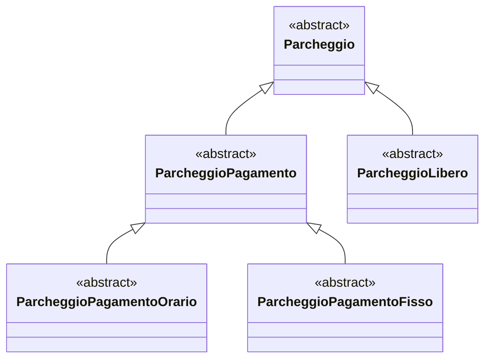

Tags: [[P.A.O]] [[Essenziali]]
# SottoClassi
Possiamo usare la classe `orario` per definire una nuova classe `dataora` che eredita da essa tutte le proprietà di `orario` ed a cui attribuiamo le ulteriori proprietà che ci interessano per modellare il concetto di orario con data.
```cpp title:dataora.h
class dataora: public orario {
public:
	int Giorno() const;
	int Mese() const;
	int Anno() const;
private:
	int giorno, mese, anno;
};
```
diciamo dunque che la classe `dataora` è *derivata* della classe `orario`.

>[!def] Terminologie analoghe #Definizione 
>Diremo che `orario` è una \__ e `dataora` è una \_\_:
>- classe base; classe derivata;
>- superclasse; sottoclasse;
>- supertipo(diretto); sottotipo (diretto)

^656ea8

La parola chiave `public` si tratta di uno specificatore di accesso che precede il nome della classe base, ed indica una *derivazione pubblica*.
 ==Ciò significa che tutti i membri della classe base vengono implicitamente ereditati dalla classe derivata, che li può usare liberamente e direttamente come fossero membri propri.==
 Nella maggior parte dei casi la *classe derivata* avrà ulteriori membri propri oltre a quelli ereditati. ^8c15ae

>[!def] **Caratteristica fondamentale dell'ereditarietà** #Definizione 
>Ogni oggetto della classe derivata è utilizzabile anche come oggetto della classe base.
In altri termini, ogni oggetto di una classe derivata può essere convertito implicitamente in un oggetto di una classe base.

>[!def] Relazione **is-a** #Definizione 
> Un oggetto di un sottotipo di `T`, è *in particolare* anche di tipo `T`.

^9ec763

>[!def] Gerarchia di classi #Definizione 
Dalla relazione *is-a* si può dedurre anche che una classe `D` derivata direttamente da una classe base `B` può a sua volta agire da classe base per qualche classe `E` che derivi direttamente da `D`.

^01bc1b

>[!note] Conversioni implicite
>In ogni [gerarchia di classi](#Gerarchie%20di%20classi), le conversioni implicite da sottotipo a supertipo valgono lungo tutta la gerachia:
>Dato `B`: supertipo, `D`: sottotipo
>- [D ==> B](#^9ec763) (tra oggetti);
>- D& ==> B&;
>- D* ==> B*;
>==Il viceversa non vale==.

Se `D` sottotipo di `b`, `b` è un oggetto di tipo `B` e `d` un oggetto di tipo `D` allora l'assegnazione `b = d`; estrae da `d` il sottooggetto di tipo `B` che esso contiene ingorando quindi l'ulteriore informazione contenuta in `d` specifica della sottoclasse `D`.
==D'altronde, la parte di `d` specifica della classe `D`, ovvero quella non ereditata da `B`, non può essere contenuta nella memoria allocata per contenere l'oggetto `b`.==
Quindi, in C++, quando si parla di polimorfismo si intende principalmente la capacità di un puntatore o riferimento ad una classe base `B` di riferirsi a una qualsiasi classe derivata da `B`.
### Tipo Statico e Tipo dinamico
Supponiamo che `D` è sottoclasse di `B`.
```cpp
D d; B b;
D* pd = &d; 
B* pb = &b;
pb = pd;
```

>Il tipo `B*` viene anche detto *il tipo statico*[^1] del puntatore `pb`. #Definizione 

Dopo l'assegnazione `pb = pd`; che è legale per polimorfismo, `pb` punta all'oggetto `d` della classe `D`: di dice quindi che il *tipo dinamico*[^2] di `pb` dopo una tale assegnazione è `D*`.

Mentre il tipo statico è determinato dalla dichiarazione del puntatore e non cambia, il tipo dinamico di un puntatore può quindi variare a run-time.

>[!info]
>La notazione di tipo dinamico è un mero concetto astratto che si usa per ragionare logicamente sull'evoluzione dinamica del tipo degli oggetti a cui puntano le variabili puntatore.
>==Sia per il compilatore che per il sistema run-time che gestisce l'esecuzione di un programma, ogni puntatore ha solo e solamente il tipo con cui è stato dichiarato nel programma, ovvero il suo tipo statico.==

> Concetti e terminologia sono analoghi per i riferimenti

```cpp
D d;
B b;
D& rd = d;
B& rb = d;
```

### Gerarchie di classi
Abbiamo già osservato che una classe derivata può a sua volta essere usata come classe base per un ulteriore passo di derivazione.
>[!example]
>```cpp
>// tpo enumerazione settimana
>enum settimana { lun, mar, mer, gio, ven, sab, dom};
>class dataorasett : public dataora {
>public:
>	settimana GiornoSettimana() const;
>private:
>	settimana giornosettimana;
>};
>```
>In questo modo abbiamo definito una semplice gerarchia di tre classi, che rappresentiamo tramite la seguenti figura: detta *diagramma della gerarchia* #Definizione 
>```mermaid
>
>flowchart TD
>
>n1["dataorasett"] --> n2["dataora"] --> n3["orario"]
>
>```

### Accessibilità
>[!question] Una classe derivata ha accesso alla parte [privata](Classi#Private) di una sua classe base?
>NO.
>La parte privata di una qualsiasi classe `B` è inaccessibile alle classi derivate da `B` come lo è per ogni altra classe diversa da `B`.
>```cpp error:2
>dataora::set2000() {
>sec = 0; // NO, illegale!
>giorno = 1;
>mese = 1;
>anno = 200;
>}
>```

Questo si risolve ponendo [protected](Classi#Protected) il sec. 
Dunque la classe `dataora` è ottenuta per [derivazione pubblica](#^8c15ae): `class dataora : public orario`.
Con la derivazione pubblica i campi [protetti](Classi#Protected) e [pubblici](Classi#Public) della classe base mantengono lo stesso livello di accessibilità anche nella classe derivata.

> Oltre alla derivazione pubblica:
> - *Derivazione Privata*: utilizza `private`, rende privati nella classe derivata i membri protetti e pubblici della classe base.
> - *Derivazione Protetta*: utilizza `protected`, rende protetti nella classe derivata i mebri pubblici e protetti della classe base.
> >[!info] N.B:
> >Entrambe le derivazioni non hanno effetto sui campi e metodi [privati](Classi#Private).
> a
> 
|Membro / Derivazione| public |  protected | private |
| --- | --- | --- | --- |
|`private` | inaccessibile | inaccessibile | inaccessibile|
|`protected`| protetto | protetto | privato |
|`public`| pubblico | protetto | privato |

La forma senz'altro più diffusa è quella `public`, detta anche **ereditarietà di tipo**. 
Questo perché permette di realizzare la relazione [is-a](#^9ec7639) => ==Un oggetto di classe derivata è anche un oggetto di classe base==.

>[!important] Concetti di membro protetto
>È importante osservare che il concetto di membro protetto di una classe va contro il [principio dell'information hiding](Programmazione%20Ad%20Oggetti#^f42cc0) (perché la modifica di un membro privato potenzialmente potrebbe richiedere la successiva modifica di tutte le classi derivate).
>Dunque il l'attributo *protected* va usato con parsimonia ==> la prassi generale è quella di dichiarare campi dati privati.

##### Ereditarietà privata vs Relazione has-a
>[!def] Ereditarietà Privata
>Significa "essere implementati in termini di".
>De `D` deriva privatamente da `B` significa che in `D` si è interessati ad alcune funzionalità di `B` e non si è invece interessati ad una relazione concettuale di subtyping tra `D` e `B`.

>==L'ereditarietà privata eredita l'implementazione di `B` ma non l'interfaccia di `B`==

>[!example] Esempio Has-A
>```cpp
>class Motore {
>private:
>	int nCilindri;
>public
>	Motore(int nc): nCilindri(nc) {}
>	int getCilindri() const { return nCilindri; }
>	void accendi() const {
>		cout << "Motore a " << getCilindri() << " cilindri accesso " << endl;
>	}
>};
>```
>Relazione Has-A
>```cpp
> class Auto {
> private:
> 	Motore mot; // Auto has-a Motore come campo dati
> public:
> 	Auto(int nc = 4): mot(nc) {}
> 	void accendi() const {
> 		mot.accendi();
>		cout << "Auto con motore a " << mot.getCilindri() << " cilindri accessa " << endl;
> 	} 	
> };
>```

>[!example] Ereditarietà privata
>```cpp
>class Motore {
>
>	int nCilindri;
>public
>	Motore(int nc): nCilindri(nc) {}
>	int getCilindri() const { return nCilindri; }
>	void accendi() const {
>		cout << "Motore a " << getCilindri() << " cilindri accesso " << endl;
>	}
>};
>```
>Ereditarietà privata
>```cpp
>class Auto: private Motore { // Auto has-a motore come sottooggetto
>public:
> 	Auto(int nc = 4): Motore(nc) {}
> 	void accendi() const {
> 		mot.accendi();
>		cout << "Auto con motore a " << getCilindri() << " cilindri accessa " << endl;
> 	} 	
>};
>```

###### Similarità
- In entrambi i casi un oggetto `Motore` "contenuto" in ogni oggetto `Auto`.
- In entrambi i casi, per gli utenti esterni, `Auto*` non è convertibile a a `Motore*`
###### Differenze
- La composizione è necessaria se servono più motori in un auto (a meno di usi limite di ereditarietà multipla).
- Ereditarietà privata può introdurre ereditarietà Multipla non necessaria
- Ereditarietà privata permette ad `Auto` di convertire `Auto*` a `Motore*`
- Ereditarietà privata permetta l'accesso alla parte protetta della base


[^1]:si riferisce al fatto che il tipo è staticamente derivabile dal codice sorgente, ossia viene determinato dal compilatore.
[^2]:si riferisce al fatto che il tipo è deducibile solamente a run-time.
##### Significato inaccessibile
Supponiamo di avere una  classe `B` il cui campo dati `b` risulta inaccessibile ad una sua sottoclasse `D`.
L'oggetto `d` di tipo `D` comunque ha `b` come campo dati.
>[!example]- Ecco come
>```cpp
>class C {
>private:
>	int i;
>public:
>	C(): i(1) {}
>	void print() const { cout << ' ' << i; }
>};
>
>class D: public C {
>private:
>	double z;
>public:
>	D(): z(3.14) {}
>	void print() const {
>		C::print() // l'oggetto di invocazione di C::print() è il
>				// sottooggetto di tipo C dell'oggetto di invocazione
>		cout << ' ' << z;
>	}
>};
>```
>```cpp title:main.cpp
>int main() {
>	C c; D d;
>	c.print(); cout << endl; // stampa 1
>	d.print(); cout << endl; // stampa 1 3.14
>}
>```

##### Significato di protected
Abbiamo `D` sottoclasse `B` che eredita `b` come membro protetto: il caso più comune è quello che `b` sia protetto in `B` e `D` è derivata direttamente e pubblicamente.
> Questo permette a `D` di **accedere solo ai `b` dei sottooggetti appartenenti alla classe `D`**. 
> Ma **non** di accedere al membro `b` di oggetti che invece appartengono alla classe `B` passata magari come parametro o usata come campo dati.
>>[!example] Esempio
>>```cpp error:14,16 ok:15,17-19
>>class B {
>>protected:
>>	int i;
>>	void protected_printB() const { cout << ' ' << i; }
>>public:
>>	void printB() const { cout << ' ' << i; }
>>};
>>a
>>class D: public B {
>>private:
>>	double z;
>>public:
>>	static void stampa(const B& b, const D& d) {
>>		cout << ' ' << b.i;
>>		b.printB();
>>		b.protected_printB();
>>		coud << ' ' << d.i;
>>		d.printB();
>>		d.protected_printB();
>>	}
>>};
>>```
>>

##### Ereditarietà ed [Amicizie](Friend)
==Una sottoclasse non eredità in alcun modo alcun tipo di [amicizie](friend) dalla classe base==.
>[!failure] No, z private in this context
>```cpp error:19
>class C {
>private:
>	int i;
>public:
>	C(): i(1) {}
>	friend void print(C);
>};
>a
>class D: public C {
>private:
>	double z;
>public:
>	D(): z(3.14) {}
>};
>
>void print(C x) {
>	cout << x.i << endl;
>	D d;
>	cout << d.z;
>}
>```

>[!success] Giusto
>```cpp
>class C {
>private:
>	int i;
>public:
>	C(): i(1) {}
>	friend void print(C);
>};
>a
>class D: public C {
>private:
>	double z;
>public:
>	D(): z(3.14) {}
>};
>
>void print(C x) {
>	cout << x.i << endl;
>}
>void print(D x) { cout << x.z << endl; }
>
>int main() {
>	C c; D d;
>	print(c); // 1
>	print(d); // 3.14
>}
>```

##### Conversioni Esplicite (static_cast) non ancora dynamic
È sempre possibile effettuare una conversione esplicita tramite uno `static_cast` per convertire un puntatore ad una classe base `B` ad una qualsiasi classe derivata `D`.
Si dovrà però garantire la correttezza di queste conversioni, cioè prima di effettuare queste conversioni esplicite si dovrà essere sicuri che il tipo dinamico del puntatore o riferimento oggetto della conversione esplicita sia `D*` o `D&`.
==Si tratta di testi dinamici fatti a run-time e la responsabilità della correttezza di queste conversioni è lasciata al programmatore.==

# Ridefinizione di metodi e campi dati
In `D`, sottoclasse di `B`, è possibile *ridefinire*, i campi dati ed i metodi ereditati da `B`.
>[!def] Ridefinizione #Definizione 
>Ciò significa che nella classe derivata `D` si ridefinisce il significato di un membro `b` ereditato da `B` tramite una nuova definizione che nasconde quella ereditata da `Bc`.
>In `D` è possibile usare l'operatore di [scoping](Namespace#^11f9a8) `B::b` per accedere al membro `b` definito in `B`.
>Questa azione di dice *"to ridefine"*.

Sia sempre `D` una classe derivata di `B`. Sia `m()` un metodo, possibilmente sovraccaricato, nella classe `B` che sia accessibile in `D`.
Allora una ridefinizione in `D` di `m()` nasconde sempre **tutte** le versioni sovraccaricate (dunque anche overload in `B`) disponibili in `B`.
Questa regola è  nota come la *name-hiding* rule. #Definizione e appunto vale per ogni ridefinizione di `m()`, che può essere di 3 tipologie. ^fbc706
- Stessa segnatura;
- Stessa lista dei parametri ma diverso tipo di ritorno;
- Diversa lista di parametri.

> Overloading e ridefinizione sono concetti diversi.

Infatti:
>[!example]
>```cpp
>class B {
>public:
>	// overloading di m()
>	void m(int x) { cout << "B::m(int)"; }
>	void m(int x, int y) { cout << "B::m(int, int)"; }
>};
>class D: public B {
>public:
>	// dichiarazione d'uso di B::m
>	using B::m;
>	//ridefinizione di m
>	void m(int x) { cout << "D::m(int)"; }
>	void m() { cout << "D::m()"; }
>};
>int main() {
>	D d;
>	d.m(3); // Compila e stampa: D::m(int)
>	d.m(3); // Compila e stampa: D::m()
>	d.m(3, 5); // Compila e stampa: D::m(int, int)
>	d.B::m(4); // Compila e stampa: B::m(int)
>}
>```

>[!info]
==Per altri esempi per capire bene guarda pagine da 187-191==
# [[Costruttori]], Assegnazione e [[Distruttore]]
### Costruttori
Naturalmente i costruttori, l'assegnazione e il distruttore della classe base **non** sono ereditati
dalla classe derivata, ma c'è la possibilità per costruttori, assegnazione, distruttori di invocare quelli della classe base.
>[!note] Richiamo sottooggetto
> Ogni oggetto di una classe derivata `D`, contiene un sottooggetto della classe base `B`.
> Dunque quando si istanzia un oggetto `d` di tipo `D` occorrerà chiamare, esplicitamente o implicitamente, nel costruttore di `D` il costruttore di `B`.
>  - *Invocazione Esplicita*: è possibile inserire nella [lista di inizializzazione](Costruttori#Liste%20di%20Inizializzazione) del costruttore `D` un'invocazione esplicita di un qualunque costruttore di `B`.
>  >[!example]- Es.
>  >```cpp
>  >D::D(): B() {}
>  >```
> 
> - *Invocazione Implicita*: se la [lista di inizializzazione](Costruttori#Liste%20di%20Inizializzazione) del costruttore di `D` non contiene costruttori espliciti di `B`, allora viene implicitamente ed automaticamente invocato il [costruttore di default](#^a16ac4) di `B`.

>Quindi la [lista di inizializzazione](Costruttori#Liste%20di%20Inizializzazione) di un costruttore di una classe `D` derivata direttamente da `B` in generale può contenere invocazioni di costruttori per campi dati di `D` e l'invocazione di un costruttore della classe base `B`.
>==La [lista di inizializzazione](Costruttori#Liste%20di%20Inizializzazione) di `D` non può contenere invocazioni di costruttori per i campi dati della classe base `B`.==

La costruzione di un oggetto `D` avviene in 2 fasi:
1. Viene prima costruito la base `B` tramite il suo costruttore
2. Viene costruita la parte specifica di `D`, secondo il comportamento noto del costruttore.

>[!example] Esempio:
>```cpp
>class Z {
>public:
>	Z() { cout << "Z0"; }
>	Z(double d) { cout << "Z1"; }
>};
>a
>class C { 
>private:
>	int x;
>	Z w;
>public:
>	C(): w(6.28), x(8) { cout << x << "C0"; }
>	C(int z): x(z) { cout << x << "C1"; }
>};
>a
>class D: public C {
>private:
>	int y;
>	Z z;
>public:
>	D(): y(0) { cout << "D0"; }
>	D(int a): y(a), z(3.14), C(a) { cout << "D1"; }
>};
>a
>int main() {
>	D d; // Stampa: Z1 8 C0 Z0 D0
>	cout << endl;
>	D e(4); // Stampa: Z0 4 C1 Z1 D1
>}
>```
#### Costruttori di Copia
Il costruttore di copia può essere *ridefinito* in `D`: esso può provocare esplicitamente il costruttore di copia di `B` o qualsiasi altro costruttore di `B`.
In mancanza di conversioni esplicite, ==viene automaticamente invocato il costruttore di default e non quello di copia di `B`==.

### Assegnazione
L'assegnazione standard di una classe `D` derivata direttamente da una classe `B` invoca preventivamente l'assegnazione della classe base `B` sul sottooggetto e successivamente esegue l'assegnazione ordinatamente membro a membro dei campi dati propri di `D` invocando le corrispondenti assegnazioni.
>[!example] Esempi a pag 197-198
>

### Distruttore
Il distruttore standard di una classe `D` derivata direttamente da `B` richiama implicitamente il distruttore della classe base `B` per distruggere il sottooggetto di `B` soltanto dopo l'azione di distruzione standard propria di `D`, cioè la distruzione dei campi dati propri di `D` nell'ordine inverso a quello di costruzione tramite l'invocazione dei corrispondenti distruttori.
Se il distruttore viene ridefinito => viene eseguito il codice di tale distruttore prima di qualunque altra distruzione.

# Metodi Virtuali
## Definizione Esempi
Abbiamo visto che esiste una conversione implicita da oggetti di una classe derivata a oggetti di una classe base che estrae i corrispondenti sottooggetti.
Supponiamo però di avere una funzione `G()`  con il parametro di tipo `orario`:
```cpp
void G(const orario& o) { o.Stampa(); }
```
Dato che appunto esiste questa conversione implicita gli possiamo passare un riferimento di tipo `dataora`. 
>[!question] Però cosa stampa `o.Stampa();`?
>Verrà invocato il metodo `orario::Stampa()` e non `dataora::Stampa()` questo perché c'è il *binding statico*, ovvero il tipo viene inferito dal compilatore a tempo di compilazione, dunque il compilatore non sa che tipo dinamico gli viene passato, dunque lui opera sulle informazioni che dispone, ovvero sa che è sicuramente una classe `orario` dunque usa la funzione `orario::Stampa()`.
>

> Noi però vorremo che venga eseguito `daraora::Stampa()`, e in C++ il modo per farlo è la dichiarazione di un **metodo virtuale**.

```cpp
class orario {
	virtual void Stampa();
	...
};
```

se dichiariamo `Stampa()` come metodo virtuale allora in `G()` verrà invocata
`dataora::Stampa()`.

>[!note] In altre parole...
>Se in una invocazione di `G(x)` il parametro attuale `x` è di tipo `dataora` allora verrà invocato il metodo `dataora::Stampa()`, mentre se è di tipo `orario` viene invocato il metodo `orario::Stampa()`.

>[!def] Binding Dinamico / Late Binding #Definizione 
> il metodo virtuale da invocare effettivamente verrà selezionato solamente a tempo di esecuzione e non staticamente dal compilatore.

---
Quindi marcato virtuale un metodo `m()` di una classe base `B` il progettista delega alle ridefinizioni di `m()` nelle sottoclassi di `B` il compito di implementare quel metodo `m()` in modo specifico alla particolare sottoclasse.
Una ridefinizione di un metodo virtuale è detta **overriding**. #Definizione 
Quando in una classe `B` si dichiara un metodo virtuale, esso rimane virtuale in tutta la gerarchia di classi derivate da `B`, anche se non è dichiarato esplicitamente nella ridefinizione operata dalle sottoclassi di `B`.
> Se una sottoclasse `D` di `B` non ridefinisce `m()` allora `D` semplicemente eredita la definizione di `m()` presente nella sua superclasse diretta.
> Il meccanismo del *dynamic binding* si applica anche agli operatori.

Naturalmente perché una invocazione di un metodo virtuale `m()` tramite un puntatore `p` di tipo `B*` possa compilare correttamente è necessario che il metodo `m()` sia disponibile nella classe `B`.
>[!example] Ad esempio:
>```cpp error:11
>class B {};
>
>class D: public B {
>public:
>	virtual void m() {}
>};
>
>int main() {
>	B b; D d; 
>	B* p = &d;
>	p->m(); // Illegale
>}
>```
>Errore in quanto `m()` non è definita in `B`.

---
Nell'overriding bisogna però prestare particolare attenzione alla *segnatura dei metodi*.
Se consideriamo un metodo virtuale `virtual T m(T1,..., Tn)` di una classe base `B`, allora l'overriding di `m()` in una classe `D` derivata da `B` ==deve mantenere la stessa segnatura di `B`, incluso il tipo di ritorno.== Ogni altro tipo di ridefinizione di `m()` provoca errori di compilazione.
> D'altra parte però rimane valida la [name-hiding rule](#^fbc706) per i metodi virtuali: in una classe `D` derivata da `B` nasconde in `D` tutti gli ulteriori eventuali overloading di `m()` in `B`.

```cpp error:24,41,43,44,46 ok:47,48
class B {
public:
	virtual int f() { cout << "B::f()\n" << return 1; }
	virtual void f(string s) { cout << "B::f(string)\n"; }
	virtual void g() { cout << "B::g()\n"; }
};

class D1: public B {
public:
	// Override di un metodo non sovraccaricato
	void g() override { cout << "D1::g()\n"; }
};

class D2: public B {
public:
	// Override di un metodo sovraccaricato
	int f() override { cout << "D2::f()\n"; }
};


class D3: public B {
public:
	// Non è possibile modificare il tipo di ritorno
	void f() override { cout << "D3::f()\n"; } // Illegale
};


class D4: public B {
public:
	// Lista degli argomenti modificata
	// ridefinizione, non override
	int f(int) { cout << "D4::f()\n"; return 1; }
};

int main() {
	string s = "ciao";
	D1 d1; D2 d2; D4 d4;
	int x = d1.f(); // Stampa: B::f()
	d1.f(s); // Stampa: B::f(string)
	x = d2.f(); // Stampa: D2::f()
	d2.f(s); // Illegale: "no matching function"
	x = d4.f(1); // Stampa: D4::f()
	x = d4.f(); // Illegale: "no matching function"
	d4.f(s); // Illegale: "no matching function"
	B& br = d4; // Cast implicito
	br.f(1); // Illegale: "no matching function"
	br.f(); // Stampa: B::f()
	br.f(s); // Stampa: B::f(string)
}
```

È ammessa una sola eccezione alla regola della preservazione della segnatura nell'overriding:
>[!def] Ritorno Covariante #Definizione 
>Nel caso in cui il tipo di ritorno sia un tipo puntatore o riferimento ad una classe:
>`virtual X* m(T1,...,Tn)`
>dove `X` è un tipo classe, allora se `Y` è una **sottoclasse** di `X` è permesso anche l'overriding.
>`virtual Y* m(T1,...,Tn)`
>Una regola analoga vale per i riferimenti

>[!warning] N.B.
>Bisogna però stare attenti all'override di metodi virtuali con valori di default.
>Supponiamo infatti di avere un metodo virtuale `m()` in una classe base `B` che preveda dei valori di default.
>Un overriding di `m()` in una classe derivata `D` non prevede che la segnatura del metodo debba necessariamente avere gli stessi valori di default di `B::m()`, anzi, non prevede nemmeno che ne abbia proprio.
>>Quindi nell'overriding di `D::m()` i valori di default possono tranquillamente essere omessi, uguali o cambiati rispetto a `B::m()`.

>[!important] Concludendo:
>L'invocazione di un metodo virtuale tramite un puntatore polimorfo - #Definizione *chiamata polimorfa* di un metodo - provoca effetti diversi a seconda del tipo dinamico del puntatore, ovvero al tipo effettivo dell'oggetto a cui punta il puntatore.
>In questo senso il polimorfismo promuove l'*estensibilità* del software, questo perché i programmi che fanno uso del polimorfismo hanno un comportamento in qualche modo indipendente dal tipo statico dei puntatori e riferimenti che invocano metodi virtuali.
>

## VTable

>[!info]
>Il late binding implica un overhead dinamico a run-time in termini di tempo e spazio

Per ogni classe `C` che contiene un metodo virtuale, il compilatore crea anche una corrispondente tabella contenente gli indirizzi dei metoi virtuali di `C`, detta **vtable** #Definizione .
Inoltre per ogni oggetto di `C`, il compilatore "include" in quell'oggetto un puntatore a funzione (detto **vpointer**) alla vtable di `C`.
La selezione run-time di quale metodo invocare in una chiamata polimorfa `p->m()` avviene seguendo tali strutture aggiuntive di puntatori:
>[!example] Ad esempio in questa gerarchia
>```cpp
>class B {
>public:
>	FunctionPointer* vptr;
>	virtual void m1() {}
>	virtual void m2() {}
>};
>
>class D1: public B {
>public:
>	virtual void m1() {} // overriding
>};
>
>class D2: public B {
>public:
>	virtual void m2() {} // overriding
>}
>```
>![[Vtable_C.canvas|Vtable_C]]

## Distruttori Virtuali
`B` deriva da `B`:
```cpp
D* pd = new D;
B* pb = pd;
delete pb;
```
In questa situazione `delete pb` richiama il [distruttore](Distruttore) della classe base `B` su un oggetto della classe derivata `D`, portando a memory leaks.
Si può evitare ciò dichiarando virtuale il distruttore della classe base `B`: in questo modo tutti i distruttori delle classi derivate da `B` diventano automaticamente virtuali ottenendo quindi l'effetto che quando viene applicato l'operatore `delete`.
> Se il distruttore di `B` è virtuale, allora tutti i distruttori delle sue classi derivate diventano virtuali.
> Per una classe che contiene metodi virtuali è buona prassi dichiarare virtuale anche il distruttore.

>[!important] Late Binding Non funzionante
>Il meccanismo di *late binding* non funzione nel corpo dei costruttori, ovvero se nel corpo di un costruttore di una classe `B` che contiene un metodo virtuale `m()` appare una invocazione di `m()`, allora quell'invocazione si riferisce sempre alla versione di `m()` locale di `B`.
>Il meccanismo di *late binding* non funziona nemmeno nel corpo dei costruttori.
## Metodi virtuali puri
In alcune circostanze una classe base `B` viene progettata solamente allo scopo di poter successivamente definire delle classi derivate da `B` e non per creare e usare oggetti di `B`.
> In tale situazione tale classe `B` funziona da *interfaccia comune* per le classi derivate da `B`. #Definizione 

Come la maggior parte dei linguaggi ad oggetti, il C++ permette quindi di dichiarare un metodo virtuale senza definirne il corpo.
Per avvisare il compilatore che il metodo non ha corpo basta aggiungere il marcatore `=0` alla fine della sua dichiarazione.
In questo caso il metodo viene definito **virtuale** #Definizione 
```cpp
class B {
...
	virtual void G() = 0;
...
};
```

>[!def] Classe Astratta #Definizione 
>Quando una classe `B` contiene o eredita senza definirlo almeno un metodo virtuale puro, `B` viene detta *classe (base) astratta*.
>Gli oggetti di una classe base astratta possono essere creati solo come sottooggetti di oggetti appartenenti ad una sottoclasse concreta di `B`.
> >[!info] N.B.
> >Una classe astratta può comunque contenere dei costruttori, inoltre è sempre possibile dichiarare dei puntatori e riferimenti a classi astratte.

^2e9f45

>[!def] Classe Concreta #Definizione 
>Una sottoclasse `D` di una classe base astratta `B` si dice *concreta* se `D` implementa tutti i metodi virtuali puri di `B`.

--- 

>[!error] Attenzione
>Può verificarsi l'esigenza di rendere astratta una qualche classe base `B` nonostante non supporti per sua natura la dichiarazione di un metodo virtuale puro.

In questi casi è comunque possibile rendere `B` astratta dichiarando che il suo [distruttore](Distruttore) virtuale sia "artificialmente" puro, nonostante esso abbia invece una piena definizione.
Si tratta quindi di una mera definizione sintattica `=0` oppure `=default` per il distruttore virtuale di `B` al fine di rendere `B` una classe astratta e quindi non permetta la costruzione di oggetti.
>[!example]
>```cpp error:9
>class B { // classe base astratta
>public:
>	virtual ~B() {} = default; // distruttore virtuale standard "puro"
>};
>
>class D: public B {}; // sottoclasse concreta
>
>int main() {
>	B b; // Illegale: "cannot declare b of type B ..."
>	D d; // Ok: D è concreta
>	B* p; // Ok, puntatore a classe astratta
>	p = &d; // puntatore polimorfo
>}
>```

## Identificazione di tipi a run-time
Il meccanismo dell'*identificazione di tipi a run-time*(RTTI) permette di determinare il tipo dinamico di un puntatore o riferimento a tempo di esecuzione. #Definizione 
I 2 principali sono:
- [[#typeid]] 
- [[#dynamic_cast]]
#### typeid
> L'operatore di `typeid` permette di determinare il tipo di una espressione qualsiasi a tempo di esecuzione, se l'espressione è un riferimento o puntatore polimorfo, allora ritorna il tipo dinamico.

```cpp
cout << typeid(i).name() << endl; // Stampa: i(nt)
cout << typeid(3.14).name() << endl; // Stampa: d(ouble)
if (typeid(i) == typeid(int)) cout << "Yes";
```

`typeid` ha come argomento un'espressione o un tipo qualsiasi e ritorna un oggetto della classe `type_info`.
```cpp title:type_info.h
class type_info {
private:
	type_info();
	type_info(const type_info&);
	type_info& operator=(const type_info&);
public:
	bool operator==(const type_info&) const;
	bool operator!=(const type_info&) const;
	const char* name() const;
};
```

>[!info] N.B:
>Non è possibile dichiarare, modificare o assegnare oggetti di tipo `type_info`, in quanto costruttore di default e di copia, distruttore e assegnazione sono privati.

`typeid` è caratterizzato dal seguente comportamento:
- Se si invoca `typeid(ref)` l'espressione `ref` operando di `typeid` è un riferimento ad un classe che contiene almeno un metodo virtuale allora `typeid(ref)`  restituisce un oggetto `type_info` che rappresenta il tipo dinamico di `ref`.
- Se si infoca `typeid(*punt)` l'espressione `*punt` operando di `typeid` è un puntatore ad una classe che contiene almeno un metodo virtuale allora `typeid(*punt)` restituisce un oggetto `type_info` che rappresenta il tipo dinamico di `*punt`.

>[!attention] Attenzione a queste regole
>1. Se la classe non è polimorfa, allora `typeid` restituisce il tipo statico del riferimento del puntatore dereferenziato.
>2. `typeid` su un puntatore non dereferenziato restituisce sempre il tipo statico del puntatore.
>3. `typeid` ignora sempre l'attributo [`const`](Const).

#### dynamic_cast
>L'operatore di conversione esplicita `dynamic_cast` permette di convertire puntatori e riferimenti ad una classe base `B` polimorfa in puntatori e riferimenti ad una classe `D` derivata da `B`.
> `dynamic_cast<B*>(D*)` la conversione sarà disponibile a seconda del puntatore della classe base passato.

Supponiamo di avere un puntatore `p` di tipo `E*` e l'istruzione `dynaimc_cast<D*>(p)`.
- L'istruzione andrà a buon fine se E è sottotipo di `D`, allora ritornerà un `D*`.
- Altrimenti il `dynamic_cast` ritornerà un puntatore nullo.

>[!important]
>Come in `typeid` anche nel `dynamic_cast` `B` deve essere polimorfa, altrimenti la compilazione provocherà un errore.

Il `dynamic_cast` permette quindi di fare 2 tipi di conversioni
- **Downcasting** #Definizione : `B* ==> D*` e `B& ==> D&` perché si converte "dall'alto verso il basso" nella gerarchia, ovvero da classe base a classe derivata.
- **Upcasting** #Definizione : `D* ==> B*` e `D& ==> D&` perché si converte "dal basso verso l'alto" nella gerarchia, ovvero dalla classe base a quella derivata.

>[!note] `dynamic_cast` di un riferimento fallito
>Se il `dynamic_cast` di un riferimento fallisce allora viene automaticamente lanciata un'[eccezione](Eccezioni) di tipo `bad_cast`.

==In generale il `dynamic_cast` viene usato solo in caso di necessità.== Ovvero si ha bisogno di un metodo proprio di una classe derivata `D`, ovvero di un metodo che non ha ereditato dalla classe `B` dunque non disponibile nella classe base.

>[!question] Se le funzioni virtuali sono così importanti e permettono di chiamare sempre la funzione *giusta*, perché sono un'opzione piuttosto che la regola?
>Per filosofia fondamentale del C++, perché le funzioni virtuali non sono efficienti come le funzioni non virtuali.
>In linguaggio assembly, per ogni chiamata ad una funzione virtuale, invece di una semplice chiamata ad un indirizzo assoluto di memoria, vi sono due istruzioni più sofisticate del linguaggio assembly che sono necessarie per implementare la chiamata di una funzione virtuale.
>Questa implementazione richiede un overhead sia in termini di spazio che di tempo di esecuzione.
## Principi S.O.L.I.D.
>[!def] SOLID è un acronimo che denota cinque principi della progettazione del software in un linguaggio di programmazione orientato agli oggetti:
> >[!quote] SOLID principi
> > Definire codice comprensibile, leggibile, mantenibile, estendibile e testabile sul quale molti sviluppatori possano lavorare collaborativamente.
> 
> Seguendo l'acronimo i principi sono:
> - [*The Single Responsibility Principle* (SRP)](#SRP) - Principio di singola responsabilità
> - [*The Open-Closed Principe* (OCP)](#OCP) - Principio aperto/chiuso
> - [*The Liskov Substitution Principle* (LSP)](#LSP) - Principio di sostituzione di Liskov
> - [*The Interface Segregation Principle* (ISP)](#ISP) - Principio di segregazione delle interfacce
> - [*The Dependency Inversion Priciple* (DIP) ](#DIP) - Il principio di inversione dell dipendenze.

### SRP
> Il principio di singola responsabilità stabilisce che una classe dovrebbe fornire un solo servizio concettuale e conseguentemente avere un'unica e chiara motivazione per modifiche successive.

Ad esempio, se una classe è un contenitore di dati aderente ad un certo modello e include campi dati per definire il concetto questa classe dovrà cambiare solamente quando verrà modificato quel modello di dati.
Inoltre questo principio rende il controllo delle versioni più semlice
### OCP
> Il principio aperto / chiuso stabilisce che le classi dovrebbero essere aperte alle estensioni e chiuse alle modifiche.

Per modifica si intende il cambiamento del codice di una classe esistente, ed estensione significa aggiungere nuove funzionalità.
Questo principio suggerisce che si dovrebbe essere in grado di aggiungere nuove funzionalità senza toccare il codice attuale della classe.
Questo perché ogni volta che modifichiamo il codice, rischiamo di dare vita ad interferenze malevole e potenziali bug.
### LSP
> Il principio di sostituzione di Liskov stabilisce che ogni sottotipo debba essre sostituibile da un proprio supertipo.

Quindi dato `B` un sottotipo di `A`, si deve essere in grado di passare un oggetto di tipo `B` ad un qualsiasi metodo che chiade un parametro di tipo `A`.
### ISP
>Il pricipio stabilisce che avere interfacce specifiche per ogni client è preferibile rispetto ad avere un'interfaccia di uso generico, questo per non forzare i client ad implementare funzioni di cui non hanno bisogno.


### DIP
>Il principio di inversione delle dipendenze stabilisce che le classi debbano dipendere da classi astratte invece che da classi concrete e funzioni.

I principi [[#OCP]] e [[#DIP]] sono legati e nella descrizione del principio aperto / chiuso ci siamo implicitamente riferiti al principio di invecsione delle dipendenze.
Si mira a progetare classi che siano aperte all'estensione, quindi si organizzano le dipendenza tra classi in modo da dipendere da classi astratte invece che da classi concrete.

