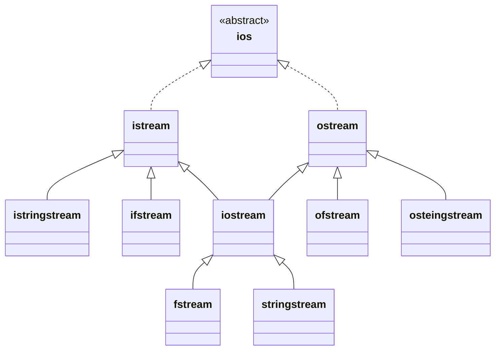

## Definizione

>[!def] Stream
>Gli oggetti delle classi di I/O vengono detti *stream*, e sono delle sequenze non limitate di celle ognuna contenente un byte.
>La posizione di una cella di uno stream è un intero che parte da 0, come negli array.

## Classe `ios`
`ios` è la classe [base](Ereditarietà#^656ea8) [astratta](Ereditarietà#^2e9f45) della [gerarchia](Ereditarietà#^01bc1b) che permette di controllare lo stato di funzionamento di uno stream.
Per quanto concerne lo stato di uno stream, la dichiarazione della classe `ios` è:
```cpp title:ios.h
class ios {
	int state;
public:
	enum io_state { goodbit = 0, eofbit = 1, failbit = 2, badbit = 4 };
	int good();
	int eof();
	int fail();
	int fail();
	int bad();
	int rdstate();
	int clear(int = 0);
	...
};
```

Uno stream può trovarsi in 8 ($2^3$) stati di funzionamento diversi.

>[!def] Stato di uno stream
>Lo stato è un intero nell'intervallo \[0,7] rappresentato dal campo dati `state` che corrisponde al numero binario
>$$
>bad\quad fail\quad eof
>$$ 
>Dove $bad$,$fail$ ed $eof$ sono dei bit di stato:
>- $eof$ = 1: Se e soltanto se si è verificato un "end-of-input" nello stream: ad esempio lo stream di un file è terminato oppure l'utente ha determinato mediante `<Ctrl>-<Z>` l'end-of-input per uno stream di input da console.
>- $fail$ = 1: Se e soltanto se una precedente operazione di I/O sullo stream è fallita: ==si tratta però di un errore senza perdita di dati==, normalmente è possibile continuare. Ad esempio ci si aspettava un carattere cifra ma si è trovato invece un carattere lettera.
>  ==Il bit di $fail$ viene messo a 1 anche quando si verifica un end-of-input==.
>- $bad$ = 1: Se e soltanto se una precedente operazione di I/O sullo stream è ==fallita con perdita dei dati==: normalmente non è possibile continuare.

Gli stati hanno corrisponenza:
- `goodbit`: 000. Significa che la precedente operazione sullo stream ha avuto successo e sullo stream può essere fatta una nuova operazione.
  Il metodo `good()` ritorna 1 se siamo nello stato `goodbit`;
- `eofbit`: 001. Significa che c'è stato un *eof*.
  Il metodo `eof()` ritorna 1 se siamo nello stato *eof*
- `failbit`: 010.Significa che c'è stato un *fail*.
  Il metodo `fail()` ritorna 1 se siamo nello stato *fail*
- `badbit`: 100.Significa che c'è stato un *bad*.
  Il metodo `bad()` ritorna 1 se siamo nello stato *bad*
  
>[!note] N.B
>Ecco pk nell'enum si è saltati da `failbit` = 2 a `badbit` = 4

> Il metodo `rdstate()` restituisce lo stato di uno stream.

>Per ripristinare lo stato di uno stream possiamo invocare il metodo `clear`.
>Il metodo `clear(int x = 0)` porta lo stream di invocazione nello stato `x`, in particolare una chiamata del tipo `s.clear()` porta lo stream di invocazione `s` nello stato `goodbit`.

## Classe `istream`
Gli oggetti della sottoclasse `istream` rappresentano stream di input.
> In particolare `std::cin` è un oggetto di tipo `istream`

La classe `istream` include l'overloading dell'operatore di input `operator>>` per i tipi primitivi e per gli array di caratteri.
```cpp
class istream: virtual public ios {
public:
	istream& operator>>(char&);
	istream& operator>>(int&);
	istream& operator>>(double&);
	istream& operator>>(char*);
	...
}
```

- `operator>>(char& c)`: preleva dall'istream di invocazione un singolo carattere e lo assegna a `c`;
- `operator>>(int&)` e `operator>>(double&)`: prelevano dall'istream di invocazione una sequenza di caratteri che rispetta la sintassi dei valori di `int` e `double` e converte tale sequenza nella rappresentazione numerica di `int` o `double`.
   ==Se la sequenza di caratteri non soddisfa la sintassi prevista, l'operazione è nulla e l'istream passa ad uno stato di errore recuperabile: $fail$ = 1 e $bad$ = 0==.
- `operator>>(char* s)`: preleva dall'istream di invocazione una sequenza di caratteri fino ad incontrare il carattere spazio (che non viene prelevato), a questa sequenza viene aggiunto il carattere nullo e infine fatta puntare da s.

>[!important] N.B.
>Tutti gli operatori di input ignorano le spaziature (cioè gli spazi, tabulazioni o CR) presenti prima del valore da prelevare

>[!attention] Fallimento di input
>Bisogna stare attenti che se una operazione di input fallisce non viene effettuato alcun prelievo dallo stream e la variabile di argomento di `operator>>` non subisce modifiche.

>[!example]- Esempio di overloading di `operator>>` in una [classe](Classi)
>```cpp
>class Punto {
>	friend istream& operator>>(istream&, Punto&);
>	// legge il punto in formato (x,y)
>private:
>	double x, y;
>};
>
>istream& operator>>(istream& in, Punto& p) {
>	char cc; in >> cc;
>	if (cc == 'q') return in; // ha prelevato q ed esce
>	if (cc != '(') { // ha prelevato un carattere diverso da (
>		in.clear(ios::failbit); // setta istream in fail
>		return in;
>	}
>	in >> p.x; // tenta di inserire il numero in p.x
>	if(!in.good()) { // se non va a buon fine allora setta istream in fail
>		in.clear(ios::failbit);
>		return in;
>	}
>	in >> cc;
>	if (cc != ',') { // controllo che ci sia , dopo il primo numero
>		in.clear(ios::failbit);
>		return in;
>	}
>	in >> p.y; // inserisco il secondo numero nel punto
>	if (!in.good()) { // se non va a buon fine setta istream in fail
>		in.clear(ios::failbit);
>		return in;
>	}
>	in >> cc;
>	if (cc != ')') { // infine controllo che ci sia ) di chiusura del punto
>		in.clear(ios::failbit);
>		return in;
>	}
>	return in;
>}
>```
>Possiamo quindi inserire degli oggetto di Punto tramite il precedente operatore di input nel seguente modo
>```cpp
>Punto p;
>cout << "Inserisci nel formato (x,y) ['q' per uscire] \n";
>while(cin.good()) {
>	cin >> p;
>	if(cin.fail()) {
>		cout << "Input non valido, ripetere!\n";
>		cin.clear(ios::goodbit);
>		char c = 0;
>		while(c != 10) { cin.get(c); } // 10 è il codice ASCII della newline, quindi svuota cin
>		cin.clear(ios::goodbit);
>	}
>}
>```

## Classe `ostream`
Gli oggetti della sottoclasse `ostream` derivata da `ios` rappresentano stream di output.
In particolare, `cout` e `cerr` sono oggetti di `ostream`.
La classe `ostream` include l'overloading dell'operatore di output `operator<<` per i tipi primitivi e per gli array di caratteri costanti.
```cpp
class ostream : virtual public ios {
public:
	ostream& operator<<(char);
	ostream& operator<<(int);
	ostream& operator<<(double);
	ostream& operator<<(const char*); // stringhe
	ostream& operator<<(const void*); // puntatori
	ostream& flush();
	...
}
```
Questi operatori convertono i parametri in sequenze e caratteri che vengono scritti nelle celle dell'ostream di invocazione.
> I caratteri della stringa vengono scritti nell'ostream fino al carattere nullo escluso.

Le operazioni di output su uno `ostream` avvengono effetivamente su un buffer associato all'ostream. Questo buffer viene svuotato dal metodo `flush()`: tale metodo viene invocato automaticamente quando si scrive un carattere di fine riga `\n` oppure il manipolatore `endl`;

## Operatori in `ios`
>[!info]
>Uno stream può essere usato come condizione booleana.
>La condizione vale `true` se e soltanto se ==il metodo `fail()` sullo stream ritorna 0, altrimenti vale `false`==.

Questo funziona pk `ios` fornisce i seguenti operatori:
```cpp
class ios {
public:
	// operatore di conversione esplicita a void*
	operator void*() const;
	// ritorna il puntatore nullo se e solo se fail() ritorna 1;

	// operatore di negazione !
	int operator!() const;
	// ritorna 0 se e soltanto se fail() vale 0
};
```

>[!example]- Esempio di utilizzo
>```cpp
>int main() {
>	int i;
>	// ciclo infinito che legge interi da cin;
>	while (cin >> i) { cout << i << endl; }
>	cout << "Non hai immesso un intero" << endl;
>}
>```

## I/O testuale e binario
### Testuale
Finora abbiamo usato `operator<<` e `operator>>` considerando gli stream come dei contenitori di testo, cioè *formato testo*.
Questo significa che dallo stream viene prima prelevata una sequenza di caratteri che costituisce la rappresentazione testuale di `x` e poi tale sequenza di caratteri viene convertita ad un valore di tipo `T` che viene assegnato ad `x`.
Questo implica che l'informazione da leggere o scrivere abbia natura testuale, ma spesso non è vero.
### Binario
In questo caso vogliamo considerare lo stream in *formato binario*, cioè tutti i singoli caratteri dello stream vengono trattati allo stesso modo senza alcuna interpretazione per i caratteri di controllo o conversione fra sequenze di caratteri e valori.
#### Input
L'input da uno `istream` in binario, cioè carattere per carattere, può essere fatto tramite i seguenti modi di `istream`.
```cpp
class istream : virtual public ios {
public:
	int get();
	istream& get(char& c);
	istream& get(char* p, int n, char c = '\n');
	istream& getline(char* p, int n, char c = '\n');
	istream& read(char* p, int n);
	istream& ignore(int n, char c = '\n');
	int gcont() const;
	...	
};
```

- `get()`: Preleva un singolo carattere (1 byte) dall'oggetto di invocazione e lo restituisce convertito ad intero. Se si è tentato di leggere EOF ritorna -1.
  Il metodo `get(char& c)` invece memorizza in `c` il carattere prelevato;
- `get(char *p, int n, char c = '\n')` preleva `n - 1` caratteri dall'oggetto di invocazione sino a che incontra il carattere di terminazione `c`, che non viene prelevato, componendo una stringa con carattere nullo finale che viene fatta puntare da `p`.
  `getline(char*, int, char)` si comporta allo stesso modo con la differenza che preleva anche il carattere di terminazione tuttavia senza memorizzarlo nella stringa.
- `read(char *p, int n)` preleva dall'oggetto di invocazione `n` caratteri, a meno che non incontri EOF, e li memorizza in `p`.
- `ignore(int n, int e = EOF)`: effettua il prelievo di `n` caratteri ma non li memorizza.
- `gcount()`: ritorna il numero di caratteri effettivamente prelevati nell'ultima invocazione del metodo `getline()` oppure `read()`.
#### Output
L'output su uno `ostream` in binario può essere fatto tramite:
```cpp
class ostream: virtual public ios {
public:
	ostream& put(char);
	ostream& write(const char*, int n);
	...
};
```
- `put(char)`: scrive il carattere sull'ostream di invocazione;
- `write(const char*, int n)`: scrive sull'ostream di invocazione i primi `n` caratteri della stringa passata.

## Stream di file
Si possono definire stream associati a file. Questi stream devono essere oggetti delle classi `ifstream` `ofstream` e `fstream`.
- `ifstream` è uno stream di file in input (input file stream == istream)
- `ofstream` è uno stream di file in output (output file stream == ofstream)
- `fstream` è uno stream di file in input e output (file stream == fstream)

### Apertura
Questi oggetti hanno diversi costruttori ognuno ma quelli più usati sono:
```cpp
ifstream(const char* nomefile, int modalita = ios::in);
ofstream(const char* nomefile, int modalita = ios::out);
fstream(const char* nomefile, int modalita = ios::in);
```
Le modalità di apertura dello stream sono specificate da un tipo `enum` nella classe `ios`.
```cpp
class ios {
public:
	enum open_mode {
		in,         // lettura
		out,        // scrittura
		ate,        // spostamento a EOF
		app,        // scrittura alla fine del file
		trunc,      // troncamento del file a lunghezza 0
		binary,     // i/o in binario, il default è text mode
		nocreate,   // falisce il file non esiste e comporta un errore non recuperabile => bad()
		noreplace   // fallisce se il file esiste
	};
	...
};
```

>[!note] Modalità di apertura multiple
>Le modalità di apertura di uno stream su file possono essere combinate tramite l'OR bitwise `|`.
>```cpp
>fstream file("dati.txt", ios::in | ios:: out);
>if (!file) cout << "Errore in apertura\n";
>```

### Chiusura
Per quanto concerne la chiusura del file si usa il metodo `close()`. `close()` chiude esplicitamente un file: esso viene automaticamente invocato dal distruttore dello stream.

### Posizionamento di una cella
Avviene tramite i seguenti metodi:
```cpp
class istream: virtual public ios {
public:
	long tellg();
	istream& seekg(long posizione);
	...
};

class ostream: virtual public ios {
public:
	long tellp();
	ostream& seekp(long posizione);
	...
};
```
Le costanti `ios::beg`, `ios::cur` e `ios::end` sono delle posizioni definite in `ios`:
- `ios::beg` = posizione iniziale dello stream, cioè 0;
- `ios::cur` = posizione corrente;
- `ios::end` = posizione finale dello stream, cioè la cella successiva all'ultimo byte dello stream (EOF).

I metodi `tellg()` e `tellp()` restituiscono il valore del contatore di posizione nello stream, mentre i metodi `seekg(long pos)` e `seekp(long pos)` portano lo stream nella posizione `pos`.

>[!example]- Esempi di utilizzo
>```cpp
>fstream f("dati.txt", ios::trunc | ios::in | ios::out);
>// crea il file dati se non esisteva
>if (!f) cout << "Errore in apertura\n";
>f << "Pippo";
>cout << f.tellp() << endl; // stampa 5
>f.seekp(ios::beg);
>f << "Topolino";
>cout << f.tellp() << endl; // stampa: 8
>f << " Pluto";
>cout << f.tellp() << endl; // stampa: 14
>f.seekg(ios::beg);
>char c;
>while(f.get(c)) cout << c; // stampa: Topolino Pluto
>cout << endl;
>f.clear();
>f.deekg(ios::beg);
>while (f >> c) cout << c; // stampa: TopolinoPluto
>cout << endl;
>f.clear();
>f.seekg(6);
>f >> c;
>cout << c << endl; // stampa: n
>```

## Stream di stringhe
Si possono definire stream associati a stringhe, ossia sequenze di caratteri memorizzate in RAM.
Il carattere nullo di terminazione gioca il ruolo di marcatore di fine stream.
Il file header che le dichiara è `<sstream>`.
```cpp
istringstream(const char*, int = ios::in);
ostringstream(int = ios::out);
ostringstream(string, int = ios::out);
stringstream(int = ios::in | ios::out);
stringstream(const char*, int = ios::in | ios::out);
```
I metodi di lettura/scrittura sono quelli ereditati da `istream`, `ostream`, `iostream`.
Il metodo `str()` applicato ad uno stream di stringhe ritorna la stringa associata allo stream.
>[!example]- Esempi di utilizzo
>```cpp
>stringstream ss;
>ss << 236 << ' ' << 3.14 << " pippo ";
>cout << ss.tellp() << ' ' << ss.tellg() << endl; // stampa 17 0
>// la stringa in memoria è "236 3.14 pippo "
>// la posizione di output è avanzata alla fine ios::end
>// la posizione di input è ancora a ios::beg
>int i;
>ss >> i;
>cout << i << endl; // stampa: 236
>double d;
>ss >> d;
>cout << d << endl; // stampa 3.14
>cout << "*" << s << "*\n"; // stampa *pippo*
>```