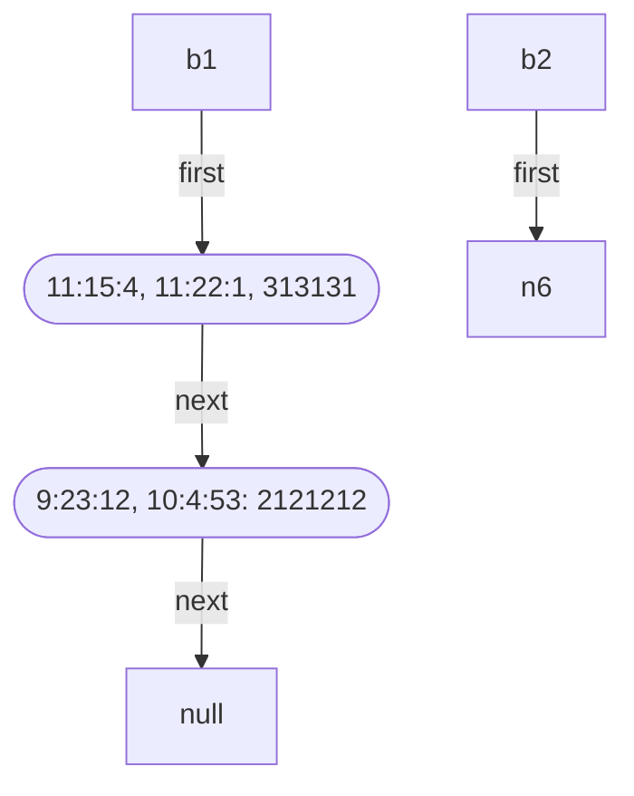
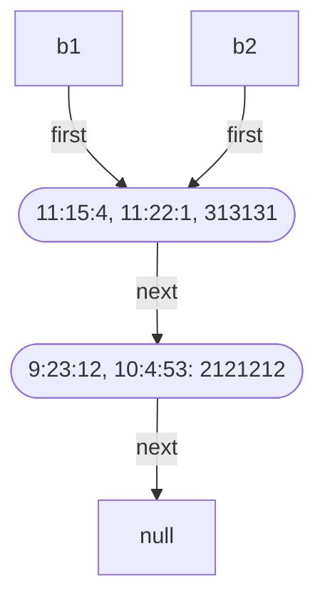
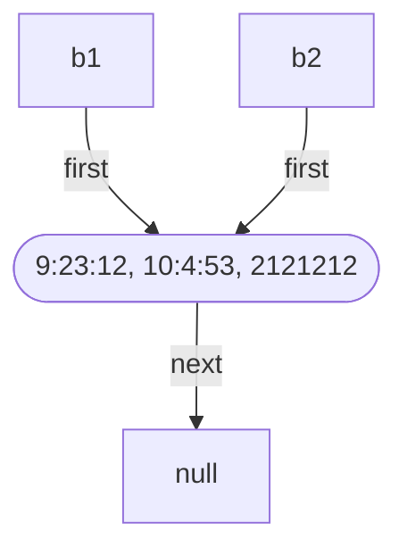

Alcuni metodi della classe `bolletta`, ad esempio `Aggiungi_Telefonata()`, modificano l'oggetto di invocazione.
Classe bolletta:
```cpp title:bolletta.h
class bolletta {
public:
	bolletta(): first(0);
	bool Vuota() const;
	void Aggiungi_Telefonata(telefonata);
	void Togli_telefonata(telefonata);
	telefonata Estrai_Una();
private:
	class nodo {
	public:
		nodo();
		nodo(const telefonata&, nodo*);
		telefonata info;
		nodo* next;	
	};
	nodo* first;
};
```

Ora che abbiamo definito `bolletta` come una lista di nodi di`telefonata`.
consideriamo il seguente esempio:
```cpp warn:8
int main() {
	bolletta b1;
	telefonata t1(orario(9, 23, 12), orario(10, 4, 53), 2121212);
	telefonata t2(orario(11, 15, 4), orario(11, 22, 1), 3131313);
	b1.Aggiungi_Telefonata(t1);
	b1.Aggiungi_Telefonata(t2);
	cout << b1;
	bolletta b2 = b1;
	b2.Togli_Telefonata(t1);
	cout << b1 << b2;
}
```
L'output sarà una cosa del genere:
```txt
TELEFONATE IN BOLLETTA:
1) INIZIO 11:15:4 FINE 11:22:1 NUMERO 3131313
2) INIZIO 9:23:12 FINE 10:4:53 NUMERO 2121212

TELEFONATE IN BOLLETTA: // b1
1) INIZIO 11:15:4 FINE 11:22:1 NUMERO 3131313

TELEFONATE IN BOLLETTA: // b2
1) INIZIO 11:15:4 FINE 11:22:1 NUMERO 3131313
```



Dopo però che ho fatto `b2 = b1`, in quanto faccio l'assegnazione standard, dunque `b1.first` sarà copiato in `b2.first` facendo si che ci siano 2 puntatori che puntano alla stessa lista.


Infine dopo `b2.Togli_Telefonata(t1)`;
La situazione diventa:



Se invece avessimo però rimosso dalla bolleta `b2` la telefonata `t2` la situazione sarebbe stata devastante:
>[!important] Punta a boh
>
>```mermaid
>flowchart TD
>
>n2["b1"] -- first --> ?
>
>n4(["9:23:12, 10:4:53, 2121212"])
>
>n4 -- next --> n7["null"]
>
>n5["b2"] -- first --> n4
>
>```

L'effetto descritto si chiama **interferenza tra oggetti o aliasing**.
>L'interferenza è dovuta da 2 cause concomitanti:
>1. Vi è condivisione di memoria tra gli oggetti;
>2. Vi sono funzioni che modificano gli oggetti;
